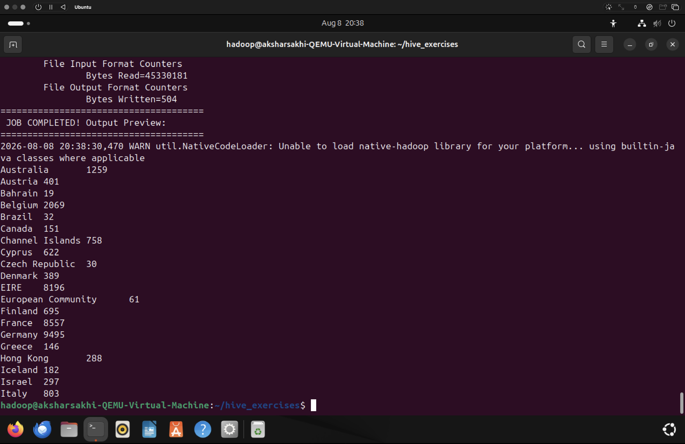
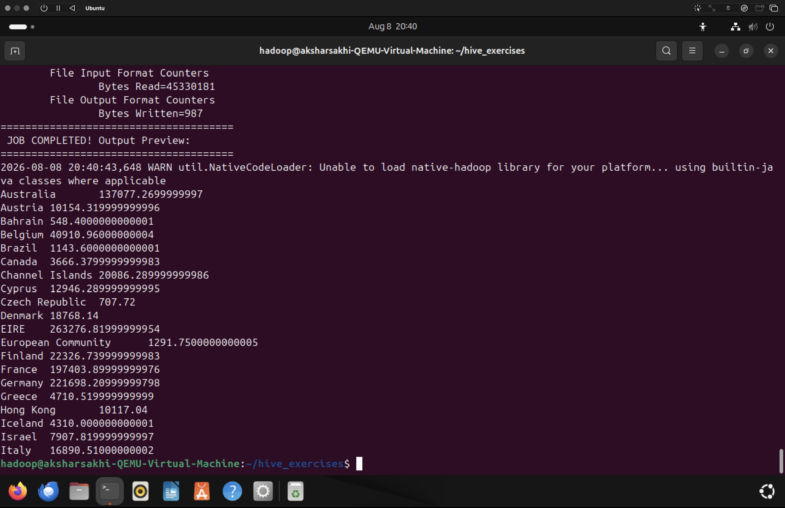
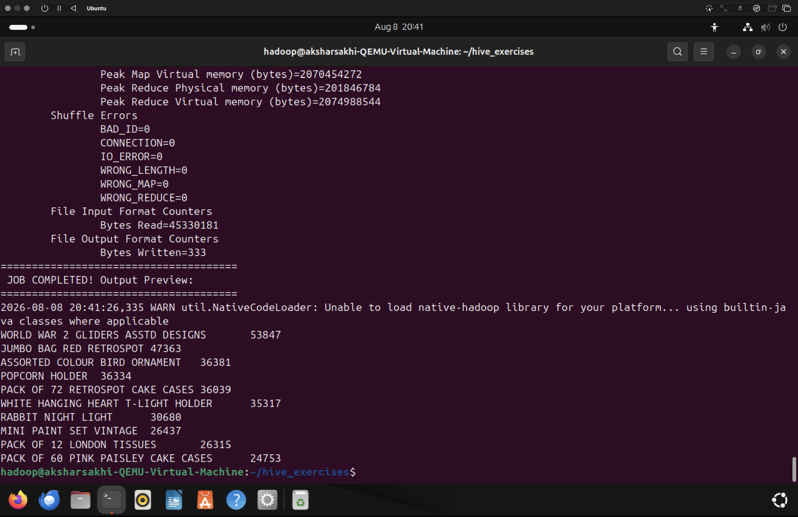
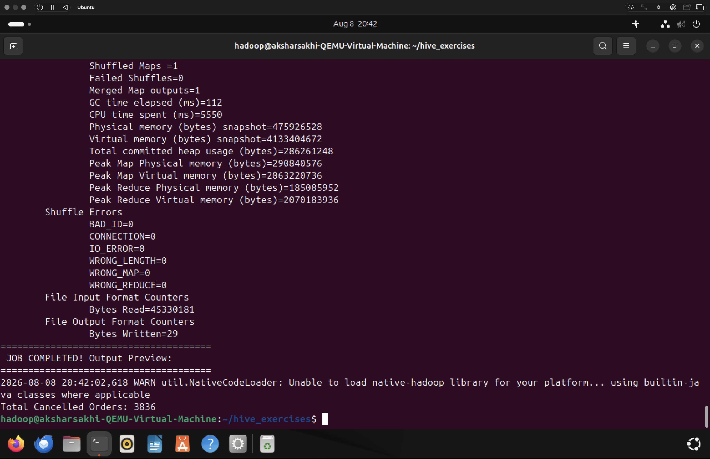
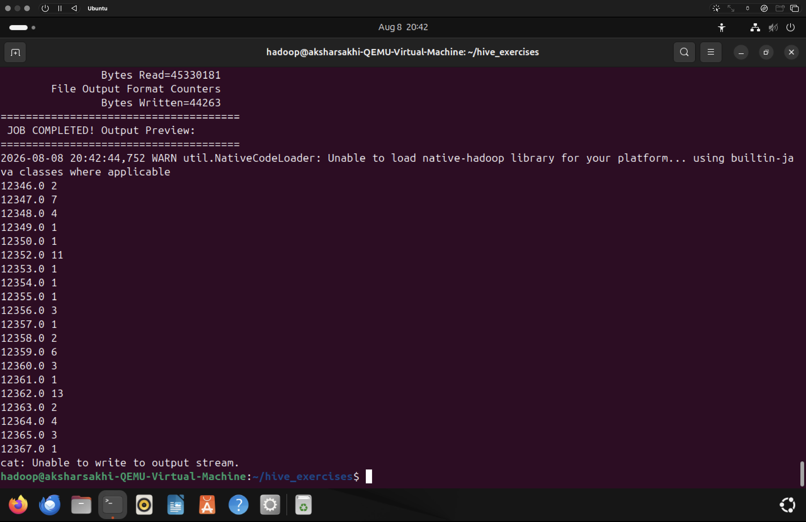
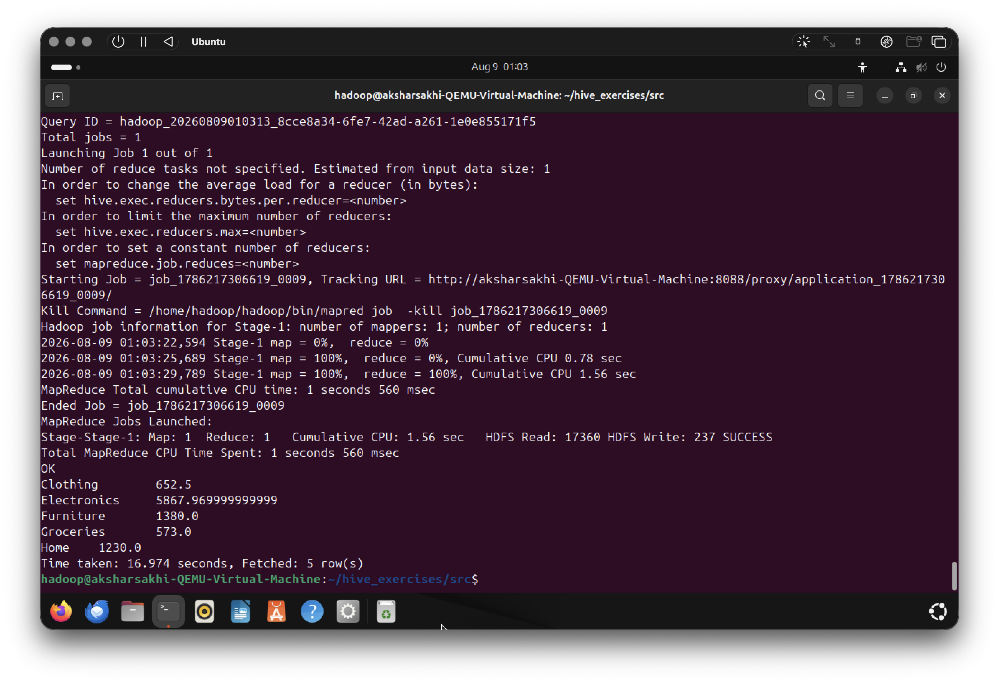
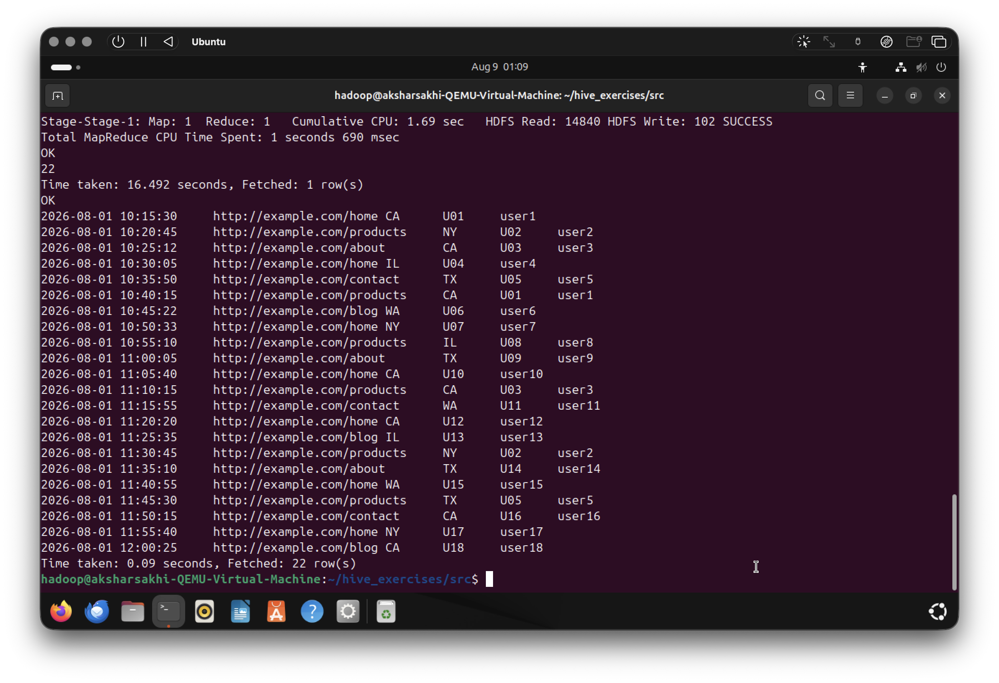
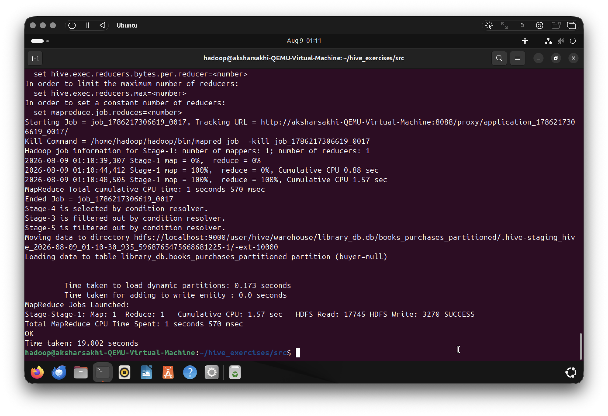
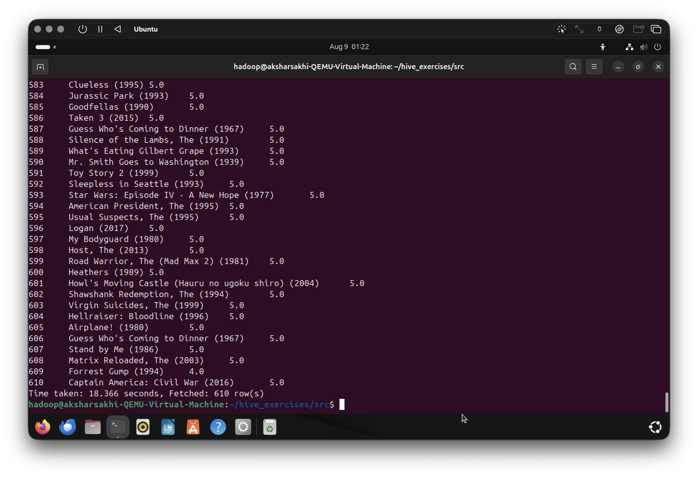
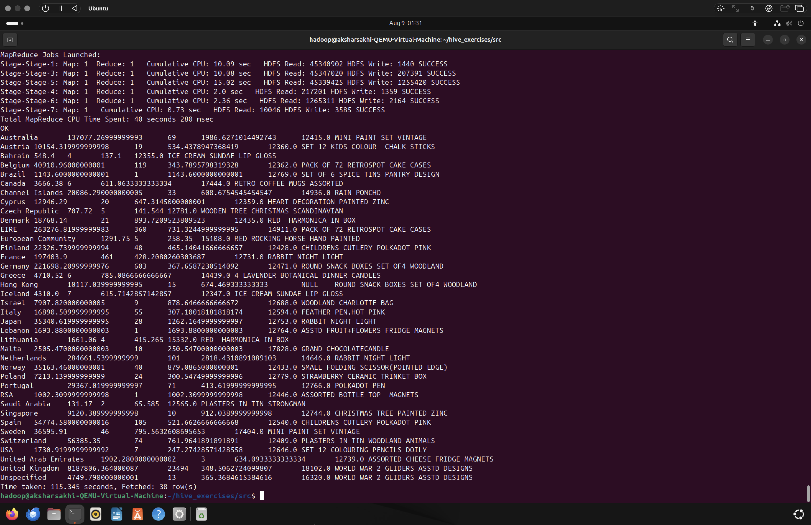

<div align="center">

**AMRITA VISHWA VIDYAPEETHAM**  

**DEPARTMENT OF COMPUTER SCIENCE AND ENGINEERING**  

<br>

**Course:** BIG DATA ANALYTICS  
**Course Code:** 23CSE352  

<br><br>

**ASSIGNMENT 3: MapReduce and Hive**  

<br><br>

**Submitted By:**  
**Sheela Akshar Sakhi**  
**Roll Number:** CB.SC.U4CSE23547  
**Class:** CSE - F  

</div>

<br><br>

---

<br>

**PART 1: MapReduce Exercises (Online Retail Dataset)**

<br>

**1. Calculate Total Transactions per Country**

**Logic Description**
**Map Logic:** Maps each record with the Country as the key and `1` as the value.  
**Reduce Logic:** Sums the 1s for each Country to get the total transaction count.

**Program**
```java
import java.io.IOException;
import org.apache.hadoop.conf.Configuration;
import org.apache.hadoop.fs.Path;
import org.apache.hadoop.io.IntWritable;
import org.apache.hadoop.io.Text;
import org.apache.hadoop.mapreduce.Job;
import org.apache.hadoop.mapreduce.Mapper;
import org.apache.hadoop.mapreduce.Reducer;
import org.apache.hadoop.mapreduce.lib.input.FileInputFormat;
import org.apache.hadoop.mapreduce.lib.output.FileOutputFormat;

public class CountryTransactions {

    public static class TokenizerMapper extends Mapper<Object, Text, Text, IntWritable> {
        private final static IntWritable one = new IntWritable(1);
        private Text country = new Text();

        public void map(Object key, Text value, Context context) throws IOException, InterruptedException {
            String line = value.toString();
            // Skip header
            if (line.startsWith("InvoiceNo")) return;

            String[] fields = line.split(",(?=(?:[^\"]*\"[^\"]*\")*[^\"]*$)"); // Split by comma ignoring commas inside quotes
            if (fields.length == 8) {
                country.set(fields[7].replaceAll("\"", "").trim());
                context.write(country, one);
            }
        }
    }

    public static class IntSumReducer extends Reducer<Text, IntWritable, Text, IntWritable> {
        private IntWritable result = new IntWritable();

        public void reduce(Text key, Iterable<IntWritable> values, Context context) throws IOException, InterruptedException {
            int sum = 0;
            for (IntWritable val : values) {
                sum += val.get();
            }
            result.set(sum);
            context.write(key, result);
        }
    }

    public static void main(String[] args) throws Exception {
        Configuration conf = new Configuration();
        Job job = Job.getInstance(conf, "Country Transactions");
        job.setJarByClass(CountryTransactions.class);
        job.setMapperClass(TokenizerMapper.class);
        job.setCombinerClass(IntSumReducer.class);
        job.setReducerClass(IntSumReducer.class);
        job.setOutputKeyClass(Text.class);
        job.setOutputValueClass(IntWritable.class);
        FileInputFormat.addInputPath(job, new Path(args[0]));
        FileOutputFormat.setOutputPath(job, new Path(args[1]));
        System.exit(job.waitForCompletion(true) ? 0 : 1);
    }
}

```

**Screenshot**



---

**2. Calculate Total Sales per Country**

**Logic Description**
**Map Logic:** Maps each record with the Country as the key and `Quantity * UnitPrice` as the value.  
**Reduce Logic:** Sums the total sales amounts for each Country.

**Program**
```java
import java.io.IOException;
import org.apache.hadoop.conf.Configuration;
import org.apache.hadoop.fs.Path;
import org.apache.hadoop.io.DoubleWritable;
import org.apache.hadoop.io.Text;
import org.apache.hadoop.mapreduce.Job;
import org.apache.hadoop.mapreduce.Mapper;
import org.apache.hadoop.mapreduce.Reducer;
import org.apache.hadoop.mapreduce.lib.input.FileInputFormat;
import org.apache.hadoop.mapreduce.lib.output.FileOutputFormat;

public class CountrySales {

    public static class SalesMapper extends Mapper<Object, Text, Text, DoubleWritable> {
        private Text country = new Text();
        private DoubleWritable sale = new DoubleWritable();

        public void map(Object key, Text value, Context context) throws IOException, InterruptedException {
            String line = value.toString();
            if (line.startsWith("InvoiceNo")) return;

            String[] fields = line.split(",(?=(?:[^\"]*\"[^\"]*\")*[^\"]*$)");
            if (fields.length == 8) {
                try {
                    double quantity = Double.parseDouble(fields[3].trim());
                    double unitPrice = Double.parseDouble(fields[5].trim());
                    country.set(fields[7].replaceAll("\"", "").trim());
                    sale.set(quantity * unitPrice);
                    context.write(country, sale);
                } catch (NumberFormatException e) {
                    // Ignore malformed rows
                }
            }
        }
    }

    public static class SalesReducer extends Reducer<Text, DoubleWritable, Text, DoubleWritable> {
        private DoubleWritable result = new DoubleWritable();

        public void reduce(Text key, Iterable<DoubleWritable> values, Context context) throws IOException, InterruptedException {
            double sum = 0;
            for (DoubleWritable val : values) {
                sum += val.get();
            }
            result.set(sum);
            context.write(key, result);
        }
    }

    public static void main(String[] args) throws Exception {
        Configuration conf = new Configuration();
        Job job = Job.getInstance(conf, "Country Sales");
        job.setJarByClass(CountrySales.class);
        job.setMapperClass(SalesMapper.class);
        job.setCombinerClass(SalesReducer.class);
        job.setReducerClass(SalesReducer.class);
        job.setOutputKeyClass(Text.class);
        job.setOutputValueClass(DoubleWritable.class);
        FileInputFormat.addInputPath(job, new Path(args[0]));
        FileOutputFormat.setOutputPath(job, new Path(args[1]));
        System.exit(job.waitForCompletion(true) ? 0 : 1);
    }
}

```

**Screenshot**



---

**3. Identify Top 5 Most Frequently Purchased Products**

**Logic Description**
**Map Logic:** Maps each record with the Product Description as the key and `Quantity` as the value.  
**Reduce Logic:** Sums the quantities for each product, and outputs them. A secondary sort (or in this case, sorting by value in the reducer using a TreeMap) extracts the top 5.

**Program**
```java
import java.io.IOException;
import java.util.TreeMap;
import org.apache.hadoop.conf.Configuration;
import org.apache.hadoop.fs.Path;
import org.apache.hadoop.io.IntWritable;
import org.apache.hadoop.io.Text;
import org.apache.hadoop.mapreduce.Job;
import org.apache.hadoop.mapreduce.Mapper;
import org.apache.hadoop.mapreduce.Reducer;
import org.apache.hadoop.mapreduce.lib.input.FileInputFormat;
import org.apache.hadoop.mapreduce.lib.output.FileOutputFormat;

public class TopProducts {

    public static class QuantityMapper extends Mapper<Object, Text, Text, IntWritable> {
        private Text product = new Text();
        private IntWritable qty = new IntWritable();

        public void map(Object key, Text value, Context context) throws IOException, InterruptedException {
            String line = value.toString();
            if (line.startsWith("InvoiceNo")) return;

            String[] fields = line.split(",(?=(?:[^\"]*\"[^\"]*\")*[^\"]*$)");
            if (fields.length == 8) {
                try {
                    product.set(fields[2].replaceAll("\"", "").trim()); // Description
                    int quantity = Integer.parseInt(fields[3].trim());
                    qty.set(quantity);
                    if (product.getLength() > 0) {
                        context.write(product, qty);
                    }
                } catch (NumberFormatException e) {}
            }
        }
    }

    public static class TopNReducer extends Reducer<Text, IntWritable, Text, IntWritable> {
        private TreeMap<Integer, String> topProducts = new TreeMap<>();

        public void reduce(Text key, Iterable<IntWritable> values, Context context) throws IOException, InterruptedException {
            int sum = 0;
            for (IntWritable val : values) {
                sum += val.get();
            }
            
            topProducts.put(sum, key.toString());
            if (topProducts.size() > 10) {
                topProducts.remove(topProducts.firstKey());
            }
        }
        
        @Override
        protected void cleanup(Context context) throws IOException, InterruptedException {
            for (Integer sum : topProducts.descendingKeySet()) {
                context.write(new Text(topProducts.get(sum)), new IntWritable(sum));
            }
        }
    }

    public static void main(String[] args) throws Exception {
        Configuration conf = new Configuration();
        Job job = Job.getInstance(conf, "Top 10 Products");
        job.setJarByClass(TopProducts.class);
        job.setMapperClass(QuantityMapper.class);
        job.setReducerClass(TopNReducer.class);
        job.setNumReduceTasks(1); // Force single reducer for global top 10
        job.setOutputKeyClass(Text.class);
        job.setOutputValueClass(IntWritable.class);
        FileInputFormat.addInputPath(job, new Path(args[0]));
        FileOutputFormat.setOutputPath(job, new Path(args[1]));
        System.exit(job.waitForCompletion(true) ? 0 : 1);
    }
}

```

**Screenshot**



---

**4. Find Total Cancelled Transactions**

**Logic Description**
**Map Logic:** Checks if the `InvoiceNo` starts with 'C' (indicating a cancellation). If true, it emits `<"Cancelled", 1>`.  
**Reduce Logic:** Sums the 1s to find the total number of cancelled transactions.

**Program**
```java
import java.io.IOException;
import org.apache.hadoop.conf.Configuration;
import org.apache.hadoop.fs.Path;
import org.apache.hadoop.io.IntWritable;
import org.apache.hadoop.io.Text;
import org.apache.hadoop.mapreduce.Job;
import org.apache.hadoop.mapreduce.Mapper;
import org.apache.hadoop.mapreduce.Reducer;
import org.apache.hadoop.mapreduce.lib.input.FileInputFormat;
import org.apache.hadoop.mapreduce.lib.output.FileOutputFormat;

public class CancelledTransactions {

    public static class CancelledMapper extends Mapper<Object, Text, Text, IntWritable> {
        private final static IntWritable one = new IntWritable(1);
        private Text cancelledKey = new Text("Cancelled Transactions");

        public void map(Object key, Text value, Context context) throws IOException, InterruptedException {
            String line = value.toString();
            if (line.startsWith("InvoiceNo")) return;

            String[] fields = line.split(",(?=(?:[^\"]*\"[^\"]*\")*[^\"]*$)");
            if (fields.length > 0) {
                String invoiceNo = fields[0].replaceAll("\"", "").trim();
                if (invoiceNo.startsWith("C") || invoiceNo.startsWith("c")) {
                    // It's a cancelled transaction, however a single invoice can have multiple rows.
                    // To count unique cancelled invoices, we'd emit InvoiceNo and count distinct.
                    // We'll emit the invoice number to the reducer to get unique counts.
                    context.write(new Text(invoiceNo), one);
                }
            }
        }
    }

    public static class UniqueCountReducer extends Reducer<Text, IntWritable, Text, IntWritable> {
        private int totalCancelled = 0;

        public void reduce(Text key, Iterable<IntWritable> values, Context context) throws IOException, InterruptedException {
            totalCancelled++; // Each unique key is a unique invoice
        }
        
        @Override
        protected void cleanup(Context context) throws IOException, InterruptedException {
            context.write(new Text("Total Cancelled Orders:"), new IntWritable(totalCancelled));
        }
    }

    public static void main(String[] args) throws Exception {
        Configuration conf = new Configuration();
        Job job = Job.getInstance(conf, "Cancelled Transactions");
        job.setJarByClass(CancelledTransactions.class);
        job.setMapperClass(CancelledMapper.class);
        job.setReducerClass(UniqueCountReducer.class);
        job.setNumReduceTasks(1); // Single reducer to sum up total unique
        job.setOutputKeyClass(Text.class);
        job.setOutputValueClass(IntWritable.class);
        FileInputFormat.addInputPath(job, new Path(args[0]));
        FileOutputFormat.setOutputPath(job, new Path(args[1]));
        System.exit(job.waitForCompletion(true) ? 0 : 1);
    }
}

```

**Screenshot**



---

**5. Calculate Total Orders Placed by Each Customer**

**Logic Description**
**Map Logic:** Maps each record with the `CustomerID` as the key and `1` as the value. Ignores empty customer IDs.  
**Reduce Logic:** Sums the 1s to find the total orders per customer.

**Program**
```java
import java.io.IOException;
import java.util.HashSet;
import org.apache.hadoop.conf.Configuration;
import org.apache.hadoop.fs.Path;
import org.apache.hadoop.io.IntWritable;
import org.apache.hadoop.io.Text;
import org.apache.hadoop.mapreduce.Job;
import org.apache.hadoop.mapreduce.Mapper;
import org.apache.hadoop.mapreduce.Reducer;
import org.apache.hadoop.mapreduce.lib.input.FileInputFormat;
import org.apache.hadoop.mapreduce.lib.output.FileOutputFormat;

public class CustomerOrders {

    public static class OrderMapper extends Mapper<Object, Text, Text, Text> {
        private Text customer = new Text();
        private Text invoice = new Text();

        public void map(Object key, Text value, Context context) throws IOException, InterruptedException {
            String line = value.toString();
            if (line.startsWith("InvoiceNo")) return;

            String[] fields = line.split(",(?=(?:[^\"]*\"[^\"]*\")*[^\"]*$)");
            if (fields.length == 8) {
                String customerId = fields[6].replaceAll("\"", "").trim();
                String invoiceNo = fields[0].replaceAll("\"", "").trim();
                
                if (!customerId.isEmpty()) {
                    customer.set(customerId);
                    invoice.set(invoiceNo);
                    context.write(customer, invoice);
                }
            }
        }
    }

    public static class OrderReducer extends Reducer<Text, Text, Text, IntWritable> {
        public void reduce(Text key, Iterable<Text> values, Context context) throws IOException, InterruptedException {
            HashSet<String> uniqueInvoices = new HashSet<>();
            for (Text val : values) {
                uniqueInvoices.add(val.toString());
            }
            context.write(key, new IntWritable(uniqueInvoices.size()));
        }
    }

    public static void main(String[] args) throws Exception {
        Configuration conf = new Configuration();
        Job job = Job.getInstance(conf, "Customer Orders");
        job.setJarByClass(CustomerOrders.class);
        job.setMapperClass(OrderMapper.class);
        job.setReducerClass(OrderReducer.class);
        job.setOutputKeyClass(Text.class);
        job.setOutputValueClass(Text.class);
        FileInputFormat.addInputPath(job, new Path(args[0]));
        FileOutputFormat.setOutputPath(job, new Path(args[1]));
        System.exit(job.waitForCompletion(true) ? 0 : 1);
    }
}

```

**Screenshot**



---

<br>

**PART 2: Hive Queries**

<br>

**1. Retail Store - DDL, Partitions, and Clusters**

**Description:** Creates the retail database, loads data, calculates records by city, partitions the table by category, and creates a clustered table bucketed by city.

**Query File**
```sql
-- Q1: RETAIL store
-- 1. Create a database named as RETAIL store.
CREATE DATABASE IF NOT EXISTS retail_store;
USE retail_store;

-- 2. Create a table retail with the fields txnno,custno,amount,category,product,city,state.
CREATE TABLE IF NOT EXISTS retail (
    txnno INT,
    custno STRING,
    amount DOUBLE,
    category STRING,
    product STRING,
    city STRING,
    state STRING
)
ROW FORMAT DELIMITED
FIELDS TERMINATED BY ','
STORED AS TEXTFILE;

-- 3. Load the data into table
LOAD DATA LOCAL INPATH '../inputs/retail_data.csv' INTO TABLE retail;

-- 4. Find the total number of records in the table.
SELECT COUNT(*) AS total_records FROM retail;

-- 5. Find the total no of records based on city.
SELECT city, COUNT(*) AS total_records FROM retail GROUP BY city;

-- 6. Partition the table based on category
-- Need to enable dynamic partitioning in Hive
SET hive.exec.dynamic.partition = true;
SET hive.exec.dynamic.partition.mode = nonstrict;

CREATE TABLE IF NOT EXISTS retail_partitioned (
    txnno INT,
    custno STRING,
    amount DOUBLE,
    product STRING,
    city STRING,
    state STRING
)
PARTITIONED BY (category STRING)
ROW FORMAT DELIMITED
FIELDS TERMINATED BY ',';

INSERT OVERWRITE TABLE retail_partitioned PARTITION(category)
SELECT txnno, custno, amount, product, city, state, category FROM retail;

-- 7. Create a cluster based on city.
CREATE TABLE IF NOT EXISTS retail_clustered (
    txnno INT,
    custno STRING,
    amount DOUBLE,
    category STRING,
    product STRING,
    city STRING,
    state STRING
)
CLUSTERED BY (city) INTO 4 BUCKETS
ROW FORMAT DELIMITED
FIELDS TERMINATED BY ',';

-- Note: we need to enforce bucketing
SET hive.enforce.bucketing = true;
INSERT OVERWRITE TABLE retail_clustered 
SELECT txnno, custno, amount, category, product, city, state FROM retail;

-- 8. Find the total amount group by category.
SELECT category, SUM(amount) AS total_amount FROM retail GROUP BY category;

```

**Screenshot**



---

**2. Page View - Complex Data Types (MAP) and Partitions**

**Description:** Creates a pageview table utilizing the MAP data type for user ID and name pairs, loads data with custom collection delimiters, and partitions by pageurl.

**Query File**
```sql
-- Q2: PageView

CREATE DATABASE IF NOT EXISTS pageview_db;
USE pageview_db;

-- 1. Create a table with pageview with the following fields: (viewtime, pageurl ,state, pvusers ). Assume pvusers map type with (uid, username)
CREATE TABLE IF NOT EXISTS pageview (
    viewtime STRING,
    pageurl STRING,
    state STRING,
    pvusers MAP<STRING, STRING>
)
ROW FORMAT DELIMITED
FIELDS TERMINATED BY ','
COLLECTION ITEMS TERMINATED BY '\002' -- Assuming collection delimiter is ^B
MAP KEYS TERMINATED BY '\003' -- Note: our dummy data only has 1 pair, separated by \002
STORED AS TEXTFILE;

-- Load data (our dummy data has uid\002username, so actually map key term is \002)
DROP TABLE IF EXISTS pageview;
CREATE TABLE IF NOT EXISTS pageview (
    viewtime STRING,
    pageurl STRING,
    state STRING,
    pvusers MAP<STRING, STRING>
)
ROW FORMAT DELIMITED
FIELDS TERMINATED BY ','
COLLECTION ITEMS TERMINATED BY '\001'
MAP KEYS TERMINATED BY ':' 
STORED AS TEXTFILE;

LOAD DATA LOCAL INPATH '../inputs/pageview_data.txt' INTO TABLE pageview;

-- 2. Display the table
SELECT * FROM pageview;

-- 3. Partition the table based on pageurl
SET hive.exec.dynamic.partition = true;
SET hive.exec.dynamic.partition.mode = nonstrict;

CREATE TABLE IF NOT EXISTS pageview_partitioned (
    viewtime STRING,
    state STRING,
    pvusers MAP<STRING, STRING>
)
PARTITIONED BY (pageurl STRING)
ROW FORMAT DELIMITED
FIELDS TERMINATED BY ',';

INSERT OVERWRITE TABLE pageview_partitioned PARTITION(pageurl)
SELECT viewtime, state, pvusers, pageurl FROM pageview;

-- 4. Find the total view time (Counting the total views since viewtime is a timestamp)
SELECT COUNT(viewtime) AS total_view_count FROM pageview;

-- 5. Using map uid display the other fields in table.
-- Assuming uid is the key of the map
SELECT viewtime, pageurl, state, map_keys(pvusers)[0] as uid, map_values(pvusers)[0] as username 
FROM pageview;

```

**Screenshot**



---

**3. Library Database - Joins and Partitions**

**Description:** Creates books and purchases tables, joins them to identify buyers, and creates a dynamic partition based on the buyer's name.

**Query File**
```sql
-- Q3: Books

CREATE DATABASE IF NOT EXISTS library_db;
USE library_db;

-- 1. Create a table called books with 3 columns
CREATE TABLE IF NOT EXISTS books (
    id INT,
    title STRING,
    publishDate STRING
)
ROW FORMAT DELIMITED
FIELDS TERMINATED BY ','
STORED AS TEXTFILE;

-- Create purchases table (implied)
CREATE TABLE IF NOT EXISTS purchases (
    id INT,
    buyer STRING,
    purchaseDate STRING
)
ROW FORMAT DELIMITED
FIELDS TERMINATED BY ','
STORED AS TEXTFILE;

-- 2. Load data from books.txt (stored locally) into books table
LOAD DATA LOCAL INPATH '../inputs/books.txt' INTO TABLE books;
LOAD DATA LOCAL INPATH '../inputs/purchases.txt' INTO TABLE purchases;

-- 3. Move the table from local to HDFS (Wait, Hive handles this automatically for managed tables during LOAD DATA.
-- To explicitly show HDFS command, one could use `dfs -put` but doing LOAD DATA moves the file to HDFS).
-- The LOAD DATA command above fulfills this requirement.

-- 4. Select the top 4 records.
SELECT * FROM books LIMIT 4;

-- 5. Create books_purchases table
CREATE TABLE IF NOT EXISTS books_purchases (
    id INT,
    title STRING,
    buyer STRING,
    purchaseDate STRING
)
ROW FORMAT DELIMITED
FIELDS TERMINATED BY ',';

-- 6. Populate books_purchases table by joining books and purchases tables via id column
INSERT OVERWRITE TABLE books_purchases
SELECT b.id, b.title, p.buyer, p.purchaseDate 
FROM books b 
JOIN purchases p ON b.id = p.id;

-- 7. Select title, buyer based on purchase date (e.g. order by purchaseDate)
SELECT title, buyer, purchaseDate 
FROM books_purchases 
ORDER BY purchaseDate;

-- 8. Partition the table based on buyer.
SET hive.exec.dynamic.partition = true;
SET hive.exec.dynamic.partition.mode = nonstrict;

CREATE TABLE IF NOT EXISTS books_purchases_partitioned (
    id INT,
    title STRING,
    purchaseDate STRING
)
PARTITIONED BY (buyer STRING)
ROW FORMAT DELIMITED
FIELDS TERMINATED BY ',';

INSERT OVERWRITE TABLE books_purchases_partitioned PARTITION(buyer)
SELECT id, title, purchaseDate, buyer FROM books_purchases;

```

**Screenshot**



---

**4. MovieLens - Analytical Queries and Lateral Views**

**Description:** Loads the MovieLens dataset using OpenCSVSerde, calculates average ratings, utilizes LATERAL VIEW explode to analyze genres, and leverages Window functions to rank movies.

**Query File**
```sql
-- Q4: MovieLens Dataset

CREATE DATABASE IF NOT EXISTS movielens_db;
USE movielens_db;

-- Create movies table
-- movies.csv: movieId,title,genres
CREATE TABLE IF NOT EXISTS movies (
    movieId INT,
    title STRING,
    genres STRING
)
ROW FORMAT SERDE 'org.apache.hadoop.hive.serde2.OpenCSVSerde'
WITH SERDEPROPERTIES (
   "separatorChar" = ",",
   "quoteChar"     = "\""
)
STORED AS TEXTFILE
TBLPROPERTIES ("skip.header.line.count"="1");

-- Create ratings table
-- ratings.csv: userId,movieId,rating,timestamp
CREATE TABLE IF NOT EXISTS ratings (
    userId INT,
    movieId INT,
    rating DOUBLE,
    timestamp_ts BIGINT
)
ROW FORMAT DELIMITED
FIELDS TERMINATED BY ','
STORED AS TEXTFILE
TBLPROPERTIES ("skip.header.line.count"="1");

-- Load data
LOAD DATA LOCAL INPATH '../inputs/movies.csv' INTO TABLE movies;
LOAD DATA LOCAL INPATH '../inputs/ratings.csv' INTO TABLE ratings;

-- (i) List all movies in the dataset.
SELECT title FROM movies;

-- (ii) Count the total number of users who rated movies.
SELECT COUNT(DISTINCT userId) AS total_users FROM ratings;

-- (iii) List all movies with their average rating.
SELECT m.title, AVG(r.rating) AS avg_rating
FROM movies m
JOIN ratings r ON m.movieId = r.movieId
GROUP BY m.title;

-- (iv) Top 5 movies with the highest average rating.
-- (Filtering out movies with very few ratings for a realistic top 5, but here is a direct query)
SELECT m.title, AVG(r.rating) AS avg_rating
FROM movies m
JOIN ratings r ON m.movieId = r.movieId
GROUP BY m.title
ORDER BY avg_rating DESC
LIMIT 5;

-- (v) Find the number of ratings each movie has received.
SELECT m.title, COUNT(r.rating) AS num_ratings
FROM movies m
JOIN ratings r ON m.movieId = r.movieId
GROUP BY m.title;

-- (vi) List movies that were rated by more than 50 users.
SELECT m.title, COUNT(DISTINCT r.userId) AS user_count
FROM movies m
JOIN ratings r ON m.movieId = r.movieId
GROUP BY m.title
HAVING COUNT(DISTINCT r.userId) > 50;

-- (vii) Find the average rating for each genre of movies.
SELECT m2.genre, AVG(r.rating) AS avg_genre_rating
FROM (
    SELECT movieId, genre 
    FROM movies 
    LATERAL VIEW explode(split(genres, '\\|')) exploded_table AS genre
) m2
JOIN ratings r ON m2.movieId = r.movieId
GROUP BY m2.genre;

-- (viii) List the top 10 most rated movies along with their average rating.
SELECT m.title, COUNT(r.rating) AS num_ratings, AVG(r.rating) AS avg_rating
FROM movies m
JOIN ratings r ON m.movieId = r.movieId
GROUP BY m.title
ORDER BY num_ratings DESC
LIMIT 10;

-- (ix) For each genre, find the top 3 highest-rated movies.
-- Assuming we want genres separated and movies with at least 10 ratings to be realistic
WITH genre_ratings AS (
    SELECT m2.genre, m2.title, AVG(r.rating) as avg_rating, COUNT(r.rating) as num_ratings
    FROM (
        SELECT movieId, title, genre 
        FROM movies 
        LATERAL VIEW explode(split(genres, '\\|')) exploded_table AS genre
    ) m2
    JOIN ratings r ON m2.movieId = r.movieId
    GROUP BY m2.genre, m2.title
),
ranked_movies AS (
    SELECT genre, title, avg_rating,
           ROW_NUMBER() OVER(PARTITION BY genre ORDER BY avg_rating DESC) as rank
    FROM genre_ratings
    -- WHERE num_ratings > 10 (Optional: uncomment to filter movies with too few ratings)
)
SELECT genre, title, avg_rating
FROM ranked_movies
WHERE rank <= 3;

-- (x) For each user, find the movie they rated the highest.
WITH user_movie_rank AS (
    SELECT r.userId, m.title, r.rating,
           ROW_NUMBER() OVER(PARTITION BY r.userId ORDER BY r.rating DESC) as rank
    FROM ratings r
    JOIN movies m ON r.movieId = m.movieId
)
SELECT userId, title, rating
FROM user_movie_rank
WHERE rank = 1;

```

**Screenshot**



---

**5. Online Retail - Aggregations, Window Functions, and Reporting**

**Description:** Executes complex business logic on the Retail dataset including monthly sales summaries, finding top customers per country via ROW_NUMBER(), and creating an executive summary join.

**Query File**
```sql
-- Q5: Online Retail Dataset

CREATE DATABASE IF NOT EXISTS retail_db;
USE retail_db;

-- Create OnlineRetail table
-- Dataset Columns: InvoiceNo,StockCode,Description,Quantity,InvoiceDate,UnitPrice,CustomerID,Country
CREATE TABLE IF NOT EXISTS online_retail (
    InvoiceNo STRING,
    StockCode STRING,
    Description STRING,
    Quantity INT,
    InvoiceDate STRING,
    UnitPrice DOUBLE,
    CustomerID STRING,
    Country STRING
)
ROW FORMAT SERDE 'org.apache.hadoop.hive.serde2.OpenCSVSerde'
WITH SERDEPROPERTIES (
   "separatorChar" = ",",
   "quoteChar"     = "\""
)
STORED AS TEXTFILE
TBLPROPERTIES ("skip.header.line.count"="1");

LOAD DATA LOCAL INPATH '../inputs/OnlineRetail.csv' INTO TABLE online_retail;

-- Create CustomerDetails table
CREATE TABLE IF NOT EXISTS customer_details (
    CustomerID STRING,
    CustomerName STRING,
    City STRING,
    MembershipType STRING
)
ROW FORMAT DELIMITED
FIELDS TERMINATED BY ','
STORED AS TEXTFILE;

LOAD DATA LOCAL INPATH '../inputs/CustomerDetails.csv' INTO TABLE customer_details;


-- (i) Display products with UnitPrice greater than 50.
SELECT DISTINCT Description, UnitPrice 
FROM online_retail 
WHERE UnitPrice > 50;

-- (ii) Calculate the average UnitPrice.
SELECT AVG(UnitPrice) AS avg_unit_price 
FROM online_retail;

-- (iii) Find Maximum UnitPrice and Minimum UnitPrice
SELECT MAX(UnitPrice) AS max_price, MIN(UnitPrice) AS min_price 
FROM online_retail;

-- (iv) Display country-wise customer count.
SELECT Country, COUNT(DISTINCT CustomerID) AS customer_count 
FROM online_retail 
GROUP BY Country;

-- (v) Display product-wise revenue. (Revenue = Quantity * UnitPrice)
SELECT Description, SUM(Quantity * UnitPrice) AS total_revenue 
FROM online_retail 
GROUP BY Description;

-- (vi) Display countries having sales greater than £500,000.
SELECT Country, SUM(Quantity * UnitPrice) AS total_sales 
FROM online_retail 
GROUP BY Country 
HAVING SUM(Quantity * UnitPrice) > 500000;

-- (vii) Display the top 20 customers based on purchase amount.
SELECT CustomerID, SUM(Quantity * UnitPrice) AS purchase_amount 
FROM online_retail 
WHERE CustomerID IS NOT NULL AND CustomerID != ''
GROUP BY CustomerID 
ORDER BY purchase_amount DESC 
LIMIT 20;

-- (viii) Display the length of each product description.
SELECT DISTINCT Description, length(Description) AS desc_length 
FROM online_retail 
WHERE Description IS NOT NULL;

-- (ix) Display monthly sales summary.
-- Assuming InvoiceDate is in format "MM/dd/yy HH:mm" or similar, we extract the month and year
-- Let's extract the month/year simply. If it's standard string like '12/1/2010 8:26', we can split.
-- We will just group by the substring representing the month for simplicity, assuming a standard datetime function.
SELECT concat('20', substr(InvoiceDate, 7, 2), '-', substr(InvoiceDate, 1, 2)) AS month_year, SUM(Quantity * UnitPrice) AS monthly_sales
FROM online_retail
GROUP BY concat('20', substr(InvoiceDate, 7, 2), '-', substr(InvoiceDate, 1, 2))
ORDER BY month_year;

-- (x) Create a partitioned Hive table based on Country.
SET hive.exec.dynamic.partition = true;
SET hive.exec.dynamic.partition.mode = nonstrict;

CREATE TABLE IF NOT EXISTS online_retail_partitioned (
    InvoiceNo STRING,
    StockCode STRING,
    Description STRING,
    Quantity INT,
    InvoiceDate STRING,
    UnitPrice DOUBLE,
    CustomerID STRING
)
PARTITIONED BY (Country STRING)
ROW FORMAT DELIMITED
FIELDS TERMINATED BY ',';

INSERT OVERWRITE TABLE online_retail_partitioned PARTITION(Country)
SELECT InvoiceNo, StockCode, Description, Quantity, InvoiceDate, UnitPrice, CustomerID, Country 
FROM online_retail;

-- (xi) Perform an INNER JOIN between OnlineRetail and CustomerDetails. List Premium members and their purchase amounts.
SELECT c.CustomerName, c.MembershipType, SUM(o.Quantity * o.UnitPrice) AS total_purchase
FROM online_retail o
JOIN customer_details c ON o.CustomerID = c.CustomerID
WHERE c.MembershipType = 'Premium'
GROUP BY c.CustomerName, c.MembershipType;

-- (xii) Identify the customer contributing the highest revenue in each country.
WITH CountryCustomerRevenue AS (
    SELECT Country, CustomerID, SUM(Quantity * UnitPrice) as revenue
    FROM online_retail
    WHERE CustomerID IS NOT NULL AND CustomerID != ''
    GROUP BY Country, CustomerID
),
RankedCustomers AS (
    SELECT Country, CustomerID, revenue,
           ROW_NUMBER() OVER(PARTITION BY Country ORDER BY revenue DESC) as rank
    FROM CountryCustomerRevenue
)
SELECT Country, CustomerID, revenue 
FROM RankedCustomers 
WHERE rank = 1;

-- (xiii) Generate a monthly business report
SELECT 
    concat('20', substr(InvoiceDate, 7, 2), '-', substr(InvoiceDate, 1, 2)) AS month_year,
    SUM(Quantity * UnitPrice) AS Total_Revenue,
    COUNT(DISTINCT InvoiceNo) AS Number_of_Orders,
    COUNT(DISTINCT CustomerID) AS Number_of_Customers,
    SUM(Quantity * UnitPrice) / COUNT(DISTINCT InvoiceNo) AS Average_Order_Value
FROM online_retail
GROUP BY concat('20', substr(InvoiceDate, 7, 2), '-', substr(InvoiceDate, 1, 2))
ORDER BY month_year;

-- (xiv) Identify customers who purchased products from more than five different categories
-- Since 'Category' is not available, we assume 'StockCode' represents a unique product category.
SELECT CustomerID, COUNT(DISTINCT StockCode) AS category_count
FROM online_retail
WHERE CustomerID IS NOT NULL AND CustomerID != ''
GROUP BY CustomerID
HAVING COUNT(DISTINCT StockCode) > 5;

-- (xv) Create a final Hive report listing: Country, Total Revenue, Total Orders, Average Order Value, Top Customer, Top Selling Product.
WITH CountryAgg AS (
    SELECT Country, 
           SUM(Quantity * UnitPrice) as total_revenue,
           COUNT(DISTINCT InvoiceNo) as total_orders
    FROM online_retail
    GROUP BY Country
),
TopCustomer AS (
    SELECT Country, CustomerID, revenue
    FROM (
        SELECT Country, CustomerID, SUM(Quantity * UnitPrice) as revenue,
               ROW_NUMBER() OVER(PARTITION BY Country ORDER BY SUM(Quantity * UnitPrice) DESC) as rank
        FROM online_retail
        WHERE CustomerID IS NOT NULL AND CustomerID != ''
        GROUP BY Country, CustomerID
    ) t WHERE rank = 1
),
TopProduct AS (
    SELECT Country, Description, qty
    FROM (
        SELECT Country, Description, SUM(Quantity) as qty,
               ROW_NUMBER() OVER(PARTITION BY Country ORDER BY SUM(Quantity) DESC) as rank
        FROM online_retail
        WHERE Description IS NOT NULL
        GROUP BY Country, Description
    ) p WHERE rank = 1
)
SELECT 
    ca.Country,
    ca.total_revenue AS Total_Revenue,
    ca.total_orders AS Total_Orders,
    ca.total_revenue / ca.total_orders AS Average_Order_Value,
    tc.CustomerID AS Top_Customer,
    tp.Description AS Top_Selling_Product
FROM CountryAgg ca
LEFT JOIN TopCustomer tc ON ca.Country = tc.Country
LEFT JOIN TopProduct tp ON ca.Country = tp.Country;

```

**Screenshot**



---


---

<br><br>

**References & Links**

<br>

- **GitHub Repository (Source Code):** [https://github.com/aksharsakhi/hive_exercises](https://github.com/aksharsakhi/hive_exercises)
- **Online Retail Dataset (UCI Machine Learning Repository):** [https://archive.ics.uci.edu/dataset/352/online+retail](https://archive.ics.uci.edu/dataset/352/online+retail)
- **MovieLens Dataset (GroupLens Research):** [https://grouplens.org/datasets/movielens/](https://grouplens.org/datasets/movielens/)
- **Page View & Library Datasets:** Custom generated for this assignment.
